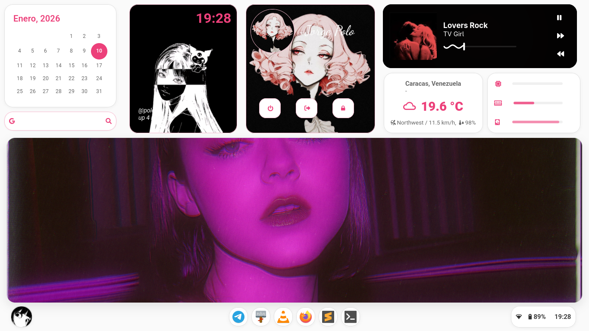
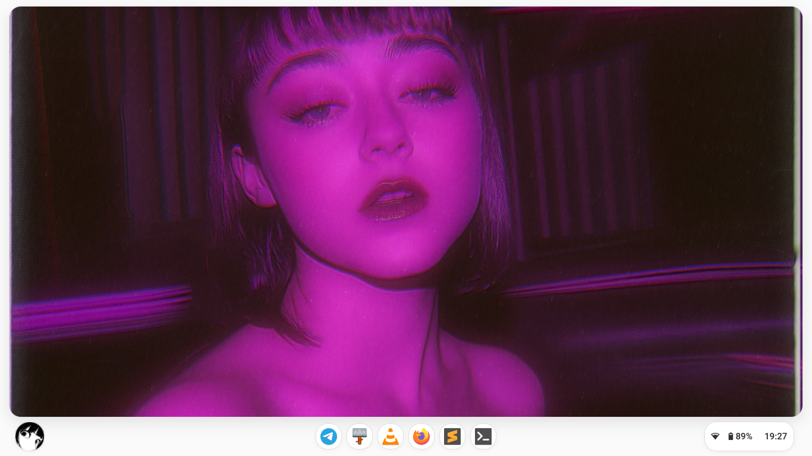

# 🍬 CandyShell (Unified Shell - GTK4/Lua)

A lightweight, custom **Wayland shell** built with **GTK4/Adwaita** and **Gtk-Layer-Shell** via Lua bindings, prioritizing modularity and a minimal desktop experience.

---

## 🛠️ Requirements

Execution requires the following components and bindings:
* **LuaJIT**
* **GTK4, Adwaita (Adw)**
* **Gtk4-Layer-Shell** (and `lgi` bindings)

---

## With love polo